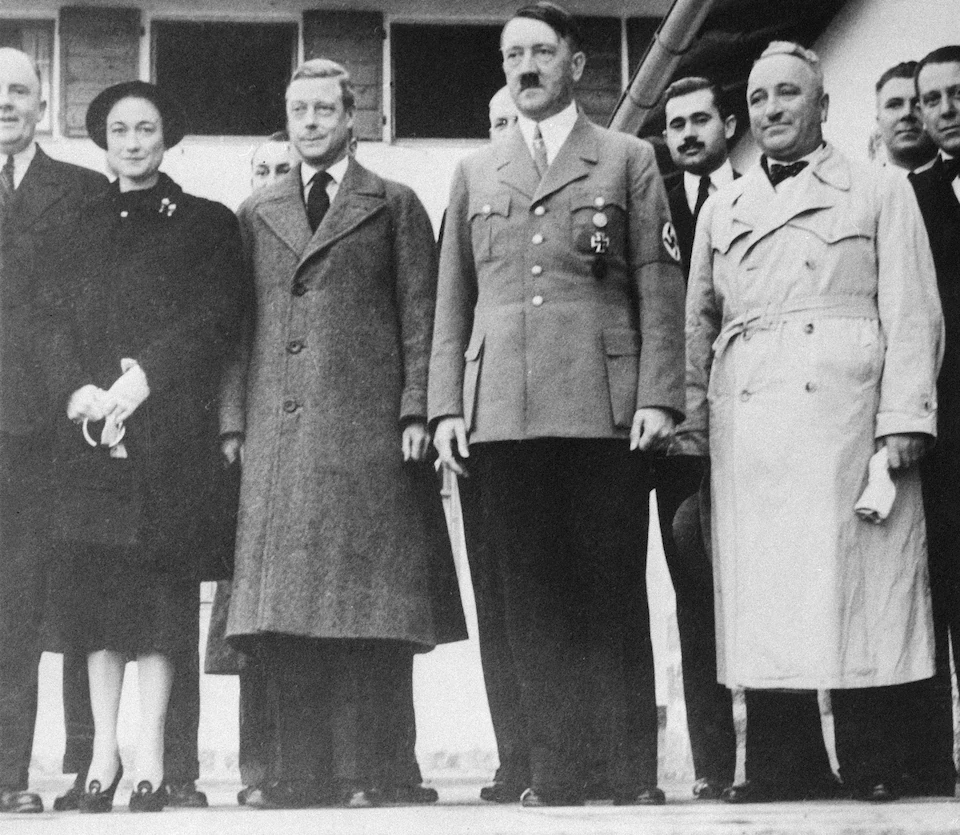

# Spy Game
## Abstract
In this game of spy, I tried to encrypt a previously-encrypted letter (written in German). This game is inspired by the secret letter from the abdicated King Edward VIII to the Nazi leader Adolf Hitler (click [here](https://www.washingtonpost.com/news/retropolis/wp/2017/12/30/fact-checking-the-crown-did-the-duke-of-windsor-plot-with-hitler-to-betray-britain/) for more info).

## What's known prior to decryption?
1. Encryption method: [Caesar cipher](https://en.wikipedia.org/wiki/Caesar_cipher)
2. A word from the letter
